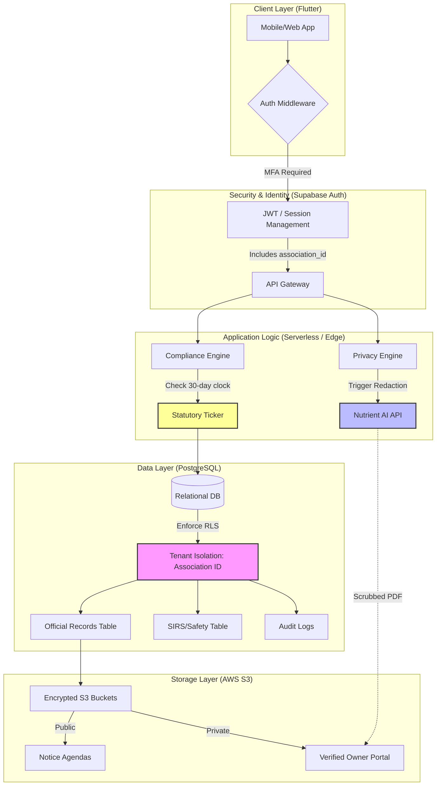
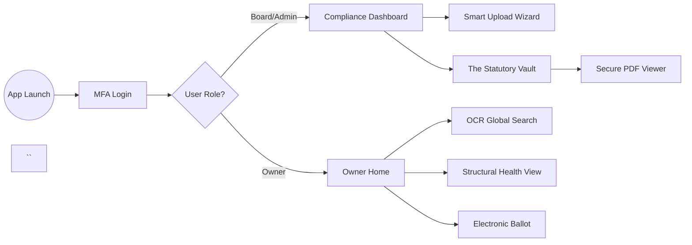

# Expense Tracker

Simple expense management app — NestJS API + Expo mobile with shared TypeScript types.

## Stack

- **API:** NestJS, Prisma, PostgreSQL, JWT auth
- **Mobile:** Expo (React Native), TanStack Query
- **Shared:** `packages/shared` — types used by both apps

## Features

- **Auth:** Email/password + Google OAuth
- **Expenses:** Add, list, delete expenses with amount, description, category
- **Per-user:** Each user sees only their own expenses

## Prerequisites

- Node.js 18+
- pnpm 9+
- Docker (for PostgreSQL)

## Setup

### 1. Install dependencies

```bash
pnpm install
```

### 2. Start PostgreSQL

```bash
cd data && docker-compose up -d && cd ..
```

### 3. Configure API

```bash
cp apps/api/.env.example apps/api/.env
# Edit apps/api/.env if needed (default matches docker-compose)
```

### 4. Run migrations

If PostgreSQL is running (from step 2):

```bash
pnpm db:deploy
```

Or for dev, push schema without migration files:

```bash
pnpm db:push
```

## Development

### API (port 3000)

```bash
pnpm api
```

### Mobile

```bash
pnpm mobile
```

For a physical device, set `EXPO_PUBLIC_API_URL` in `apps/mobile/.env` to your machine's IP (e.g. `http://192.168.1.100:3000`).

## Scripts

| Command           | Description           |
| ----------------- | --------------------- |
| `pnpm api`        | Start API dev server  |
| `pnpm mobile`     | Start Expo dev server |
| `pnpm build`      | Build shared + API    |
| `pnpm db:migrate` | Run Prisma migrations |
| `pnpm db:studio`  | Open Prisma Studio    |
| `pnpm clean`      | Remove build/cache dirs (dist, .expo, coverage, etc.) |

## Project structure

```
├── apps/
│   ├── api/          # NestJS + Prisma
│   └── mobile/       # Expo app
├── packages/
│   └── shared/       # Shared types
├── data/             # Docker Compose for Postgres
└── pnpm-workspace.yaml
```




